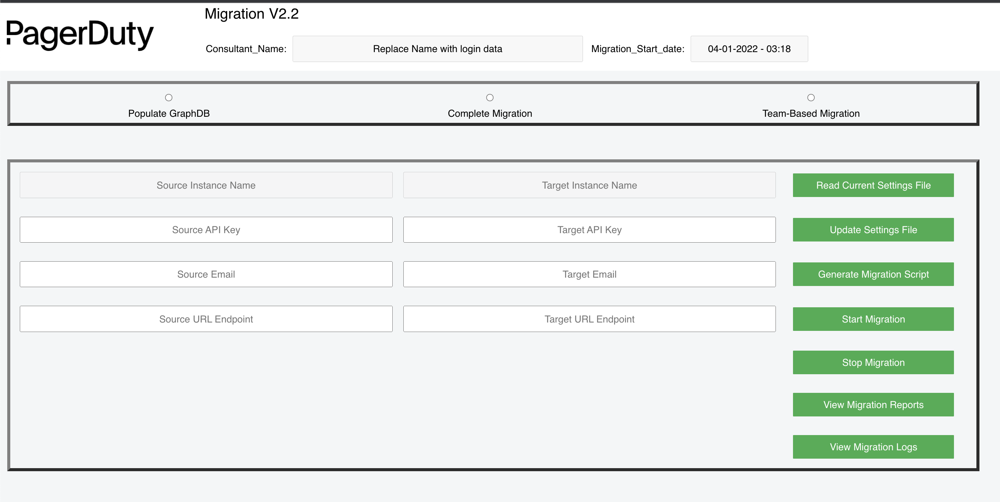
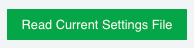
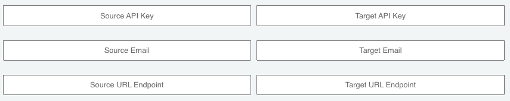
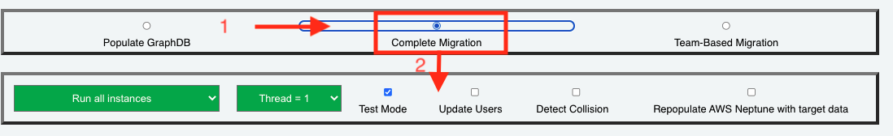
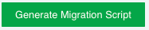
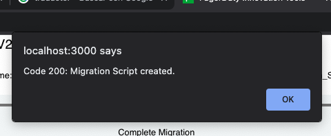

# PagerDuty Migration V2.1 Web App

- [Introduction](#introduction)
    - [Requirements and Destination Preparation](#requirements-and-destination-preparation)
    - [Getting Started](#getting-started)
- [Main View](#main-view)
- [Reading Current Settings](#reading-current-settings)
- [Updating Settings](#updating-settings)
- [Generating Migration Script](#generating-migration-script)
- [Start and Stop Migration Process](#start-and-stop-migration-process)
- [View Migration Reports and Logs](#view-migration-reports-and-logs)
- [Important Notes](#important-notes)

## Introduction
The Migration V2.1 Web App is written in React JS (frontEnd) and Python (BackEnd). With this application the following tasks are simplified during the migration process:

* Read the configuration file for the selected migration project.
* Set new values for migration project settings file (Source & target Api keys, emails and url's).
* Allows select the migration process and execution options, then you can generate a migration script to simplify the start of the process.
* Allows start migration (under construction).
* Allows stop migration (under construction).
* Allows view migration reports (under construction).
* Allows review and check migration logs (under construction).

## Requirements and Destination Preparation
* Node JS., version 16.14.2
* Run: npm install -r in your shell
* (under construction).

## Getting Started.
UNDER CONSTRUCTION.

## Main View.

## Reading Current Settings.
Selecting this    option will allow you to read the settings associated with the selected migration project. If the associated configuration values are empty
(default value when starting a migration are empty) must be completed and updated before continuing with the process.

All settings parameters associated with any migration are encrypted and can only be read through this application.

## Updating Settings.
When selecting this option    all values entered the selection screen will be transferred to the corresponding configuration, associated with selected migration. 
Validations for API Tokens are performed to ensure that they are valid.  The other settings parameters entered should be verified to avoid future errors when migration begins.

The Source & Target Instance Names are extracted from each API Token entered automatically. If te API Token is not valid, an error message will be showed.

## Generating Migration Script.
An execution script allows to call a migration process quickly and easily, due to allowing to graphically select all execution options required beforehand.

In order to generate a migration script, you must first select the type of migration is going to be executed and then the available options will be displayed (see image)

Then you can press   and see the confirmation popup:

This option creates the following script files, depending on the selected migration process:

    utils/
      run_migration.json
      run_population.json
      run_teamMigration.json

After a migration script was created, the execution process should only be started by calling a simple command. Example:

    python3 statistics_report.py [it uses all selected option in run_migration.json file]

## Start and Stop Migration Process.
UNDER CONSTRUCTION.

## View Migration Reports and Logs.
UNDER CONSTRUCTION.

## Important Notes.
UNDER CONSTRUCTION.

